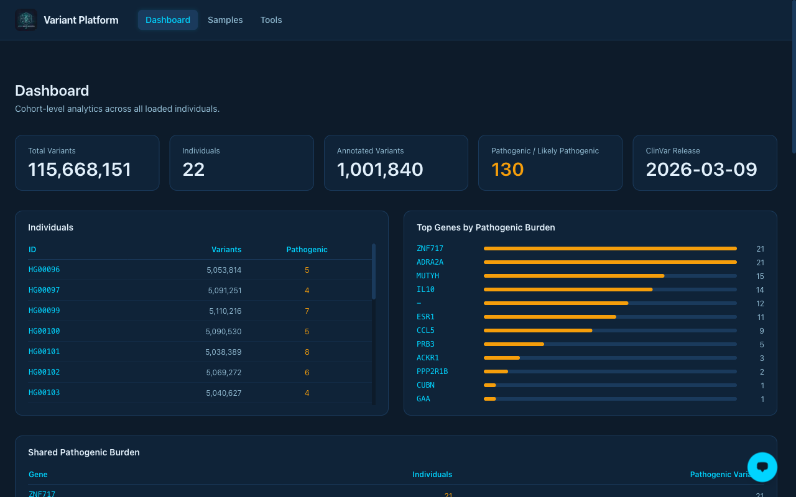
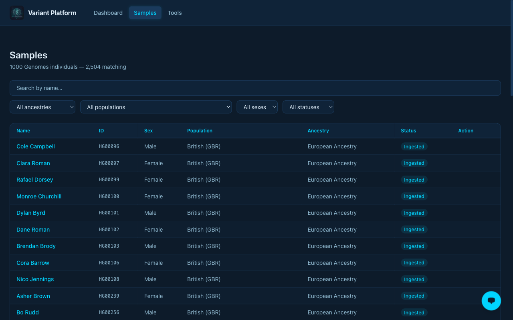
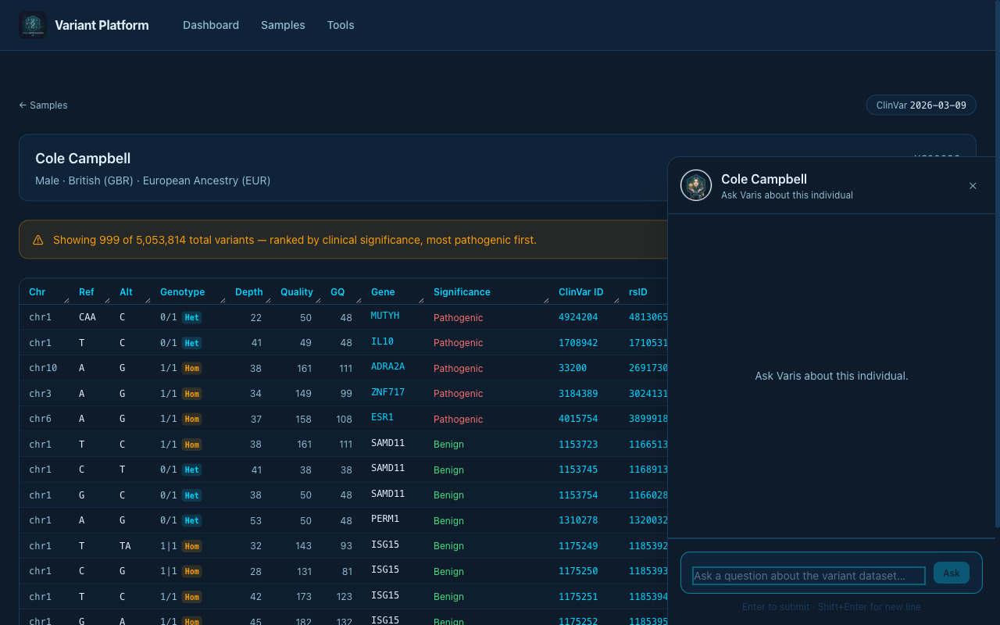
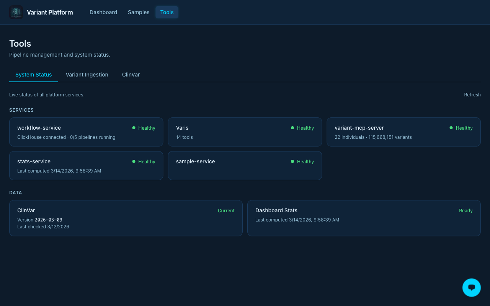

# Genomic Variant Platform

A cloud-native genomic variant analysis platform with an agentic natural language query interface. Built on GCP, ClickHouse, and the Model Context Protocol (MCP).

Clinicians and researchers can ask plain-language questions about variant data — *"What pathogenic variants does this individual carry?"* or *"Which genes carry the highest pathogenic burden across the cohort?"* — and receive accurate, cited answers without writing queries. The platform ingests whole-genome sequencing VCFs, joins them with ClinVar clinical annotations, and stores them in a columnar analytical database optimised for genomic query patterns.

All services run on GCP inside a private VPC. The only entry point is a WireGuard VPN gateway.

---

## Screenshots

**Cohort Dashboard** — live stats across all ingested individuals: 115.6M variants, 22 individuals, 130 pathogenic/likely pathogenic calls, and top genes by pathogenic burden.



**Sample Browser** — search and filter 2,504 individuals from the 1000 Genomes Project by ancestry, population, sex, and ingestion status.



**Individual Detail + Varis Agent** — per-individual variant table with clinical significance colour-coding, alongside the Varis AI agent panel for natural language queries about that individual.



**System Status** — live health checks across all backend services, ClinVar currency, and pipeline readiness.



---

## Architecture

```
  User (laptop)
      │
      │  WireGuard VPN
      ▼
  ┌────────────────────────────────────────────────────────────────────┐
  │  GCP VPC (internal only)                                           │
  │                                                                    │
  │  ┌────────────┐  ┌──────────────┐  ┌─────────────┐  ┌──────────┐  │
  │  │  Agent API │  │ Pipeline API │  │ Sample Svc  │  │  Web UI  │  │
  │  │ (Cloud Run)│  │ (Cloud Run)  │  │ (Cloud Run) │  │ (Next.js)│  │
  │  └──────┬─────┘  └──────┬───────┘  └──────┬──────┘  └──────────┘  │
  │         │               │                 │                        │
  │  ┌──────▼──────┐   ┌────▼─────────────────▼────────────────────┐  │
  │  │ MCP Service │   │              Firestore                    │◄┐ │
  │  │ (Cloud Run) │   │  pipeline state · samples · dash cache    │ │ │
  │  │  22 tools   │   └───────────────────────────────────────────┘ │ │
  │  └──────┬──────┘                                                  │ │
  │         │ TCP 9000          ┌──────────────────────────────────┐  │ │
  │  ┌──────▼────────────────┐  │       Stats Service              ├──┘ │
  │  │   ClickHouse (GCE)    │◄─┤       (Cloud Run)                │    │
  │  │ variants · annotations│  │  aggregates ClickHouse → cache   │    │
  │  └───────────────────────┘  └──────────────▲───────────────────┘    │
  │              ▲                             │ on completion          │
  │    ┌─────────┴─────────────────────────────┘                        │
  │    │       Cloud Workflows                                          │
  │    │  VCF Ingest  │  ClinVar Refresh                               │
  │    └────────────────────────────────────────────────────────────────┘
  └────────────────────────────────────────────────────────────────────┘
```

**Seven Cloud Run services (all `ingress: internal`):**

| Service | Purpose |
|---------|---------|
| **Web UI** | Pipeline management, agent chat, cohort dashboard, and sample browser (Next.js) |
| **Agent API** | Natural language genomic queries — Claude reasoning loop, SSE streaming answers |
| **Pipeline API** | Submit and monitor VCF ingest and ClinVar refresh runs, Firestore state tracking |
| **MCP Service** | 22 structured genomic query tools over Streamable HTTP — the agent's data interface |
| **Sample Service** | 1000 Genomes sample metadata API — fuzzy search, filter by ancestry/population/sex |
| **Stats Service** | Pre-computes cohort dashboard aggregates from ClickHouse into Firestore for instant load |

---

## What the Agent Can Do

The Varis agent (powered by Claude) reasons across 22 MCP tools to answer questions like:

- *"What pathogenic variants does HG00096 carry?"*
- *"Which genes carry the highest pathogenic burden across the cohort?"*
- *"How many individuals carry a variant in MUTYH?"*
- *"What is the clinical significance of this locus?"*
- *"Compare the variant load between CEU and YRI populations."*

The agent performs multi-hop reasoning — querying by individual, by gene, by locus, and across the cohort — and cites every data point back to ClinVar.

---

## Repositories

> **All source repositories are currently private** pending completion of a security review.
> To request read access, open an issue on this repository or contact [@ryanratcliff](https://github.com/ryanratcliff) directly.

| Repo | Description |
|------|-------------|
| `infra` | Pulumi (Python) — VPC, ClickHouse VM, WireGuard gateway, IAM, secrets, buckets, Artifact Registry, Firestore |
| `variant-pipeline` | Cloud Workflow: download VCF → normalize (Cloud Batch / bcftools) → load to ClickHouse |
| `clinvar-pipeline` | Cloud Workflow: ClinVar monthly refresh → version check → enrich (Cloud Batch) → upsert annotations |
| `variant-mcp-server` | Cloud Run MCP service — 22 structured genomic query tools over Streamable HTTP |
| `agent-service` | Cloud Run FastAPI — Claude reasoning loop over MCP tools, SSE answer stream |
| `workflow-service` | Cloud Run FastAPI — submit and monitor pipeline runs, Firestore state tracking |
| `sample-service` | Cloud Run FastAPI — 1000 Genomes sample metadata with fuzzy search |
| `stats-service` | Cloud Run FastAPI — cohort-level aggregations cached to Firestore |
| `vap-ui` | Cloud Run Next.js — pipeline management, agent query, cohort dashboard, sample browser |

---

## Design Rationale

**ClickHouse for analytical genomics** — the variant workload is columnar by nature: per-individual scans of millions of rows, range queries, and cohort aggregations. ClickHouse's MergeTree sort key and vectorised execution are a natural fit. Separate `variants` and `annotations` tables allow ClinVar to be refreshed monthly without touching variant call data.

**MCP as the agent's data interface** — the MCP service exposes structured tools that the agent uses through multi-hop reasoning. Tool names, descriptions, and schemas are independent of ClickHouse internals, so the storage layer can evolve without touching the agent.

**Private-by-default networking** — no public Cloud Run endpoints, no external IPs. All services run with `ingress: internal` inside a private VPC. WireGuard is the single ingress point, keeping the attack surface minimal.

**Infrastructure as Python with Pulumi** — every service in this platform is written in Python, and the infrastructure is no different. Pulumi gives real loops, functions, type hints, and pytest for infra tests with no DSL context-switching.

**Deploy-on-merge CI** — all nine repositories use GitHub Actions with Workload Identity Federation (keyless auth) for zero-credential deployments. Merging to main deploys automatically.

---

## Data Sources

| Source | Use |
|--------|-----|
| [1000 Genomes Project](https://www.internationalgenome.org/) | Prototype variant data — per-individual WGS VCFs, GRCh38 |
| [ClinVar](https://www.ncbi.nlm.nih.gov/clinvar/) | Clinical significance annotations — monthly refresh |
| [GIAB HG002](https://www.nist.gov/programs-projects/genome-bottle) | Validation truth set — known variant ground truth for correctness testing |

All prototype data is public. No patient data is used at any stage.

---

## GCP Services

Cloud Run · Compute Engine (ClickHouse, n2-highmem-8) · Cloud Batch · Cloud Workflows · Cloud Scheduler · Cloud Storage · Firestore · Artifact Registry · Secret Manager · VPN Gateway (WireGuard)

---

## Tech Stack

Python · FastAPI · Next.js · ClickHouse · Anthropic Claude · Model Context Protocol · Pulumi · bcftools · WireGuard

---

## Privacy & Data Disclaimer

All individual names displayed in this platform (e.g. "Cole Campbell", "HG00096") are **auto-generated placeholder names** assigned to sample IDs for display purposes only. They are not the names of real people and do not correspond to any identifiable individual.

All underlying data is sourced exclusively from public research datasets (1000 Genomes Project, ClinVar). No protected health information (PHI), patient records, or clinical data of any kind is used at any stage. This platform is a research and engineering prototype and is not a covered entity under HIPAA. Any resemblance between auto-generated display names and real individuals is entirely coincidental and unintentional.

---

## License

[CC BY-NC 4.0](../LICENSE) — © 2025 Ryan Ratcliff. Free for non-commercial use with attribution. Commercial use requires prior written consent.
